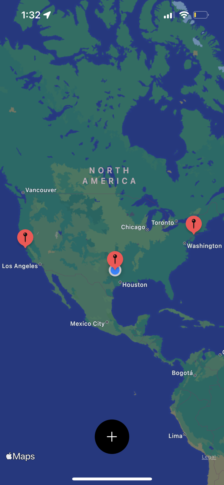

<!-- PROJECT SHIELDS -->
<!--
*** I'm using markdown "reference style" links for readability.
*** Reference links are enclosed in brackets [ ] instead of parentheses ( ).
*** See the bottom of this document for the declaration of the reference variables
*** for contributors-url, forks-url, etc. This is an optional, concise syntax you may use.
*** https://www.markdownguide.org/basic-syntax/#reference-style-links
-->
[![Contributors][contributors-shield]][contributors-url]
[![Forks][forks-shield]][forks-url]
[![Stargazers][stars-shield]][stars-url]
[![Issues][issues-shield]][issues-url]
[![LinkedIn][linkedin-shield]][linkedin-url]


<!-- PROJECT LOGO -->
<br />
<div align="center">
  <a href="https://github.com/github_username/repo_name">
    
  </a>

<h3 align="center">High Waters</h3>

  <p align="center">
    An iOS app, that will help people repost flooded areas around the world, Using fireabase as a backend.
    <br />
    <a href="https://github.com/mamascor/High-Waters"><strong>Explore the docs »</strong></a>
    <br />
    <br />
    <a href="https://github.com/mamascor/High-Waters">View Demo</a>
    ·
    <a href="https://github.com/mamascor/High-Waters/issues">Report Bug</a>
    ·
    <a href="https://github.com/mamascor/High-Waters/issues">Request Feature</a>
  </p>
</div>


<!-- TABLE OF CONTENTS -->
<details>
  <summary>Table of Contents</summary>
  <ol>
    <li>
      <a href="#about-the-project">About The Project</a>
      <ul>
        <li><a href="#built-with">Built With</a></li>
      </ul>
    </li>
    <li>
      <a href="#getting-started">Getting Started</a>
      <ul>
        <li><a href="#installation">Installation</a></li>
      </ul>
    </li>
    <li><a href="#contact">Contact</a></li>
  </ol>
</details>

<!-- ABOUT THE PROJECT -->
## About The Project




---


### Built With

* [UIkit](https://developer.apple.com/documentation/uikit)
* [Firebase](https://firebase.google.com/)


<p align="right">(<a href="#top">back to top</a>)</p>


<!-- GETTING STARTED -->
## Getting Started

This is an example of how you may give instructions on setting up your project locally.
To get a local copy up and running follow these simple example steps.


### Installation

1. Clone the repo
   ```sh
   git clone https://github.com/mamascor/high-waters.git
   ```
2. Install Firebase, go to xcode, file, add packages and paste this link.
   ```sh
   https://github.com/firebase/firebase-ios-sdk
   ```
3. Select Database as the option and set up your database in test mode

<p align="right">(<a href="#top">back to top</a>)</p>

<!-- CONTACT -->
## Contact

Your Name - [@MarcoAnMa](https://twitter.com/MarcoAaMa) - marco.mascorroa@gmail.com

Project Link: [https://github.com/mamascor/high-waters](https://github.com/mamascor/high-waters)

<p align="right">(<a href="#top">back to top</a>)</p>


<!-- MARKDOWN LINKS & IMAGES -->
<!-- https://www.markdownguide.org/basic-syntax/#reference-style-links -->
[contributors-shield]: https://img.shields.io/github/contributors/mamascor/high-waters.svg?style=for-the-badge
[contributors-url]: https://github.com/mamascor/high-waters/graphs/contributors
[forks-shield]: https://img.shields.io/github/forks/mamascor/high-waters.svg?style=for-the-badge
[forks-url]: https://github.com/mamascor/high-waters/network/members
[stars-shield]: https://img.shields.io/github/stars/mamascor/high-waters.svg?style=for-the-badge
[stars-url]: https://github.com/mamascor/high-waters/stargazers
[issues-shield]: https://img.shields.io/github/issues/mamascor/high-waters.svg?style=for-the-badge
[issues-url]: https://github.com/mamascor/high-waters/issues
[license-shield]: https://img.shields.io/github/license/mamascor/high-waters.svg?style=for-the-badge
[license-url]: https://github.com/mamascor/high-waters/blob/master/LICENSE.txt
[linkedin-shield]: https://img.shields.io/badge/-LinkedIn-black.svg?style=for-the-badge&logo=linkedin&colorB=555
[linkedin-url]: https://linkedin.com/in/marcoamascorro
[product-screenshot]: images/screenshot.png
